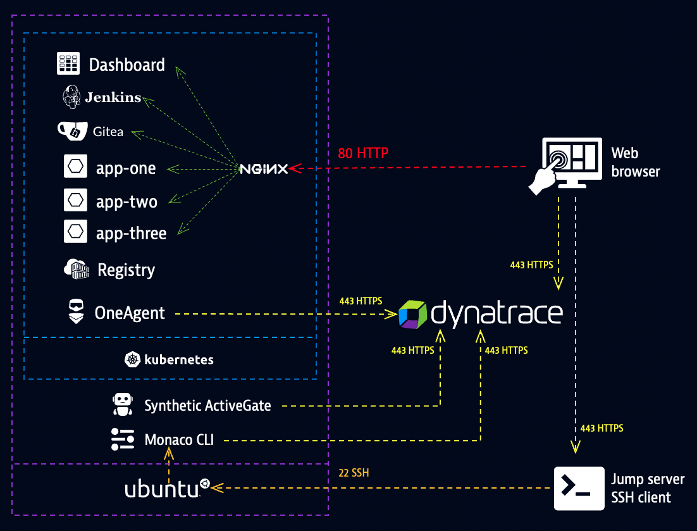

## Lab environment

### Overview
Each participant has a dedicated lab environment that includes: 
* Dynatrace environment (a.k.a. Dynatrace tenant)
* Kubernetes cluster
    * Dashboard (links and app status)
    * Jenkins (automation server)
    * Gitea (Git server)
    * Applications (app-one, app-two, app-three)
    * Container registry
    * OneAgent (deployed by OneAgent Operator)
    * Nginx (reverse proxy)
* Synthetic ActiveGate (private location)
* Monaco (command line interface tool)



### Connect
1. Open the **web shell** through the launchpad dashboard

2. Execute the command below to ensure Monaco is properly installed on your VM.

    ```
    monaco
    ```

    The expected output for this command will be the Monaco help page that explains usage and command options.

    ```bash
    You are currently using the old CLI structure which will be used by
    default until monaco version 2.0.0

    Check out the beta of the new CLI by adding the environment variable
    "NEW_CLI".

    NAME:
    monaco - Automates the deployment of Dynatrace Monitoring Configuration to one or multiple Dynatrace environments.

    USAGE:
    monaco [global options] command [command options] [working directory]

    VERSION:
    1.6.0

    DESCRIPTION:
    Tool used to deploy dynatrace configurations via the cli

    Examples:
        Deploy a specific project inside a root config folder:
        monaco -p='project-folder' -e='environments.yaml' projects-root-folder

        Deploy a specific project to a specific tenant:
        monaco --environments environments.yaml --specific-environment dev --project myProject

    COMMANDS:
    help, h  Shows a list of commands or help for one command

    GLOBAL OPTIONS:
    --verbose, -v                             (default: false)
    --environments value, -e value            Yaml file containing environments to deploy to
    --specific-environment value, --se value  Specific environment (from list) to deploy to (default: none)
    --project value, -p value                 Project configuration to deploy (also deploys any dependent configurations) (default: none)
    --dry-run, -d                             Switches to just validation instead of actual deployment (default: false)
    --continue-on-error, -c                   Proceed deployment even if config upload fails (default: false)
    --help, -h                                show help (default: false)
    --version                                 print the version (default: false)
    2022-02-03 11:40:27 ERROR Required flag "environments" not set
   ```

3. Open the **ACE dashboard** through the launchpad dashboard.

4. Open **Gitea** through the launchpad dashoard and log in with the displayed credentials

5. Open **Jenkins** through the launchpad dashoard and log in with the displayed credentials

> **Note:** The Monaco documentation can be found on [GitHub](https://github.com/dynatrace-oss/dynatrace-monitoring-as-code).

### We're now ready to kick off the lab!
