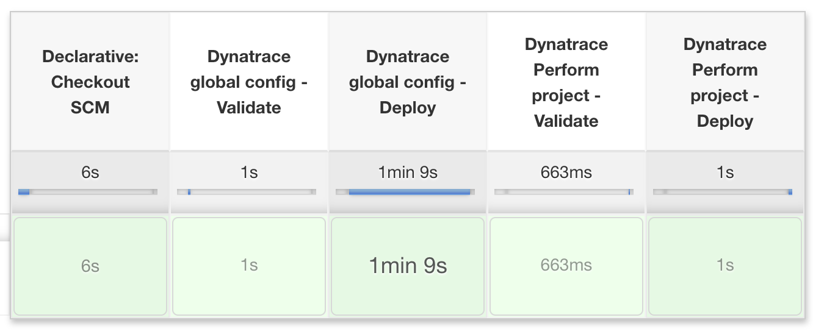
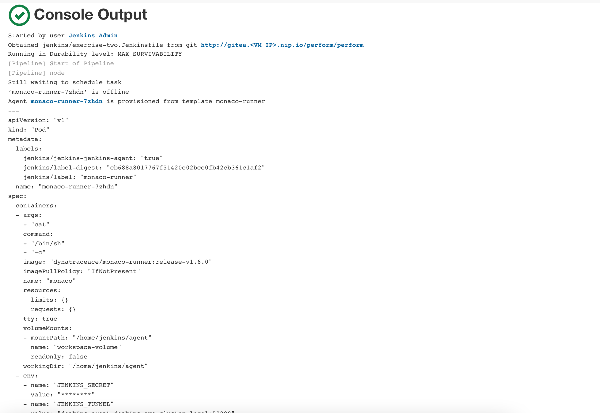
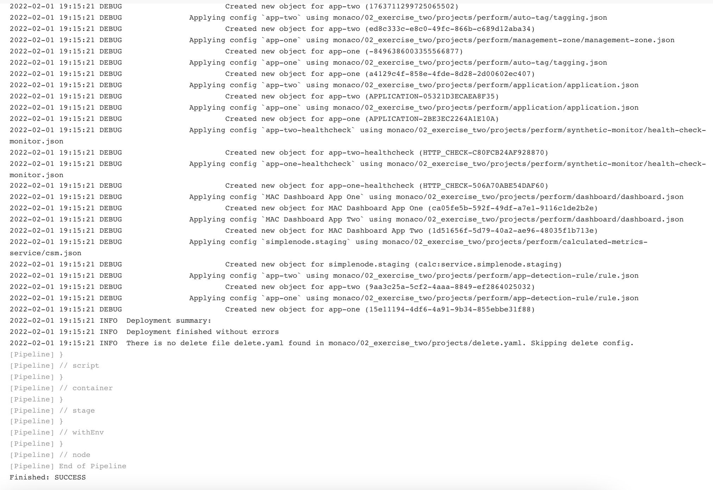

## Ex 2: Monaco pipeline automation

During this exercise, we'll apply a large number of configurations to our Dynatrace environment using a Jenkins pipeline.



The pipeline includes two Monaco projects:

1. A project **"global"** that contains more generic configuration:
    * Auto tagging rules
    * Request attributes
    * Synthetic locations

2. A project **"perform"** that contains configuration specific to our apps `app-one` and `app-two`:
    * Application definition
    * Application detection rules
    * Auto tagging rules
    * Calculated services metrics
    * Dashboards
    * Management zones
    * Synthetic monitors

### Step 1 - Explore configuration
#### Folder structure
1. In Gitea, explore the contents of the `perform/monaco/02_exercise_two` folder. It looks like this:

    ```
    │── environments.yaml
    └── projects
        │── global
        │   │── auto─tag
        │   │   │── auto─tag.json
        │   │   └── auto─tag.yaml
        │   │── request─attributes
        │   │   │── request─attribute.json
        │   │   └── request─attribute.yaml
        │   └── synthetic─location
        │       │── private─synthetic.json
        │       └── synthetic─location.yaml
        └── perform
            │── app─detection─rule
            │   │── rule.json
            │   └── rules.yaml
            │── application
            │   │── application.json
            │   └── application.yaml
            │── auto─tag
            │   │── tagging.json
            │   └── tagging.yaml
            │── calculated─metrics─service
            │   │── csm.json
            │   └── csm.yaml
            │── dashboard
            │   │── dashboard.json
            │   └── dashboard.yaml
            │── management─zone
            │   │── management─zone.json
            │   └── zone.yaml
            └── synthetic─monitor
                │── health─check─monitor.json
                └── synthetic─monitors.yaml
    ```

#### Jenkins pipeline
2. In Gitea, open the file `perform/jenkins/exercise-two.Jenkinsfile`

    The file contents look like this:

    ```groovy
    ENVS_FILE = "monaco/02_exercise_two/environments.yaml"

    pipeline {
        agent {
            label 'monaco-runner'
        }
        stages {
            stage('Dynatrace global config - Validate') {
                steps {
                    container('monaco') {
                        script{
                            sh "monaco -v -dry-run -e=$ENVS_FILE -p=global monaco/02_exercise_two/projects"
                        }
                    }
                }
            }
            stage('Dynatrace global config - Deploy') {
                steps {
                    container('monaco') {
                        script {
                            sh "monaco -v -e=$ENVS_FILE -p=global monaco/02_exercise_two/projects"
                            sh "sleep 60"
                        }
                    }
                }
            }       
            stage('Dynatrace Perform project - Validate') {
                steps {
                    container('monaco') {
                        script{
                            sh "monaco -v -dry-run -e=$ENVS_FILE -p=perform monaco/02_exercise_two/projects"
                        }
                    }
                }
            }
            stage('Dynatrace Perform project - Deploy') {
                steps {
                    container('monaco') {
                        script {
                            sh "monaco -v -e=$ENVS_FILE -p=perform monaco/02_exercise_two/projects"
                        }
                    }
                }
            }       
        }
    }
    ```

3. Let's take a closer look at a few sections

    ```groovy
    agent {
        label 'monaco-runner'
    }
    ...
    ...
    container('monaco')
    ```

    The Jenkins pipeline uses the container image `monaco-runner` which contains the Monaco CLI. 

    > **Tip:** The `monaco-runner` container image can be used within any CI/CD or automation platform as long as it supports running a Docker image with a volume mount. For more information, visit: [monaco-runner](https://github.com/dynatrace-ace/monaco-runner)

4. Let's now take a look in Jenkins. 

    Go to `Manage Jenkins` > `Manage Nodes and Clouds` > `Configure Clouds` > `Pod Templates` (bottom one) > `Pod Template monaco-runner` > `Pod Template details...` and look at the configuration.

    

    By using this pod template in Jenkins, we make the `monaco` command available within our pipeline.

#### The environments file
5. Let's go back to Gitea and open file `perform/jenkins/exercise-two.Jenkinsfile`

    On the first line we can see a reference to a Monaco environments file:

    ```groovy
    ENVS_FILE = "monaco/02_exercise_two/environments.yaml"
    ```

    The contents of that environments file look like this:

    ```yaml
    perform:
    - name: "perform"
    - env-url: "{{ .Env.DT_TENANT_URL }}" 
    - env-token-name: "DT_API_TOKEN" 
    ```

    We defined a Dynatrace environment for Monaco called `perform`.

    The attributes `env-url` and `env-token-name` contain the names of environment variables that contain the environment's URL and API token respectively.

    > **Note:** There's a difference in notation for environment variables. Within Monaco it's possible to use environment variables anywhere, by using the format `{{ .Env.YOUR_ENV_VAR_NAME }}`
    > 
    > For the token, it's slightly different as historically this was  always the name of an environment variable. There we just use the format `ENV_VAR_NAME` without curly brackets or dots.

This begs the question: ***Where are the values of these variables stored?***

Jenkins automatically passes all environment variables that are defined in its system to running pipelines. 

6. Go ahead and open `Manage Jenkins` > `Configure System` and scroll down a bit. You'll see all environment variables that are defined, including the Dynatrace Environment URL and Dynatrace API tokens:

    

    When Monaco is running, it'll initialize all environment variables where it can. If an environment variable is not set, a validation error will be thrown.

#### Dry-run vs deploy
7. For each project, notice that there are two pipeline stages:

    ```groovy
    stage('Dynatrace global config - Validate') {
        steps {
            container('monaco') {
                script{
                    sh "monaco -v -dry-run -e=$ENVS_FILE -p=global monaco/02_exercise_two/projects"
                }
            }
        }
    }
    stage('Dynatrace global config - Deploy') {
        steps {
            container('monaco') {
                script {
                    sh "monaco -v -e=$ENVS_FILE -p=global monaco/02_exercise_two/projects"
                    sh "sleep 60"
                }
            }
        }
    }       
    ```

    For the first stage, we add an extra argument `-dry-run` to the command, which will validate the structure and dependencies of our project without actually deploying anything.

    > **Note:** `monaco --dry-run` is similar to 
    > * `terraform plan` on Terraform
    > * `kubectl --dry-run=client` on Kubernetes

### Step 2 - Trigger pipeline
Now that we're familiar with the project structure and the contents, let's trigger our pipeline.

1. Open your Jenkins Dashboard, then the pipeline `Exercise 2 - Apply all`, and click on `Build Now`

    

    The pipeline will now run and apply the two Monaco projects⁠—**global** and **perform**⁠—to your Dynatrace environment.

    Wait until the pipeline has finished, with all stages completed successfully:

    

2. Click on the build number to see the build details. (In the screenshot above the build number is **#1**) Click on **Console Output**

    

    In the **Console Output** you can track the progress and changes that Monaco made

    

    

### Step 3 - View results in Dynatrace
Now, go to your Dynatrace environment and verify that Monaco created all the configurations as described in the two Monaco projects.

### Step 4 - Change configuration and re-apply
1. Take one of the configuration items that were created and make a change in the JSON file (apart from the name!).

    You could for example change case sensitivity for a tagging rule in `perform/monaco/02_exercise_two/projects/perform/auto-tag/tagging.json` but feel free to experiment yourself. 

    

2. Re-run the pipeline and see the changes taking effect in Dynatrace.

### Congratulations on completing Exercise 2!
